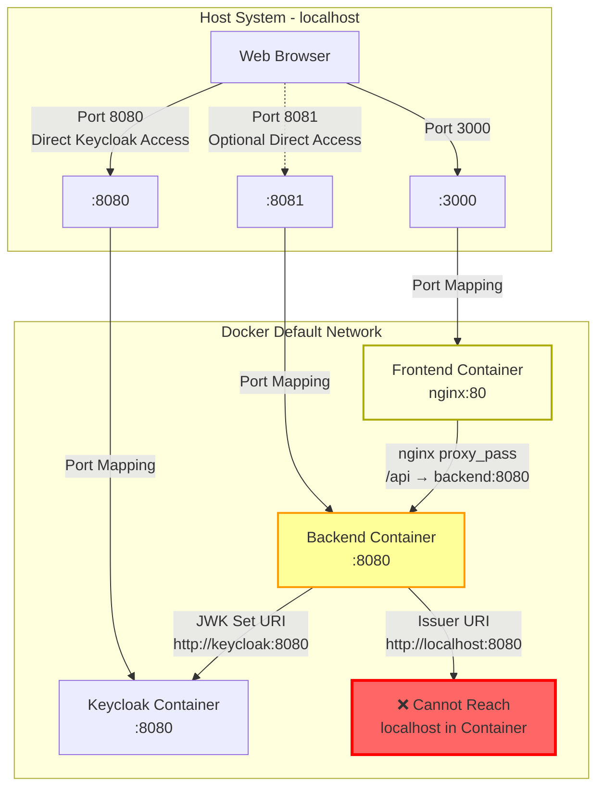
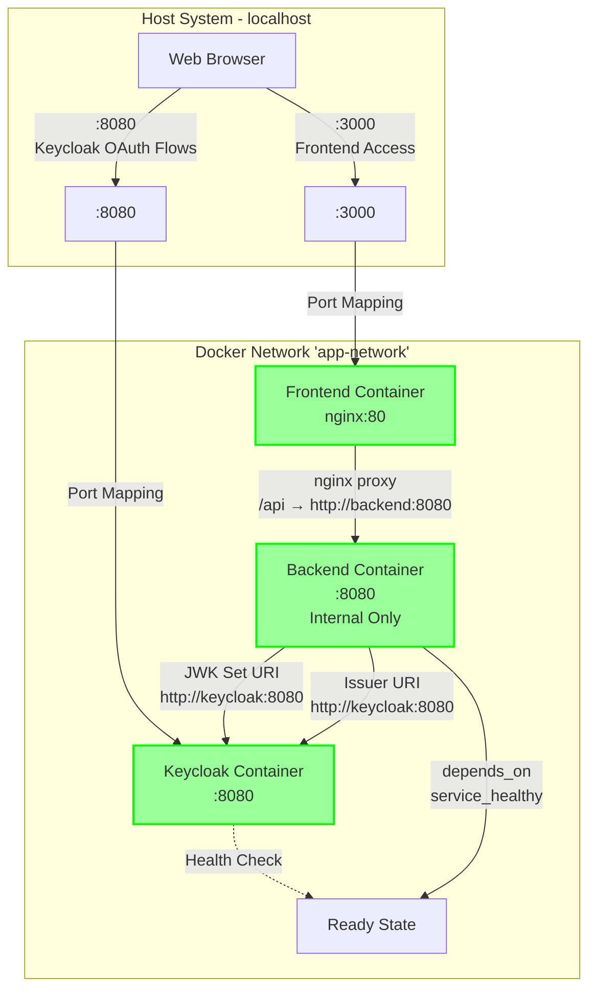
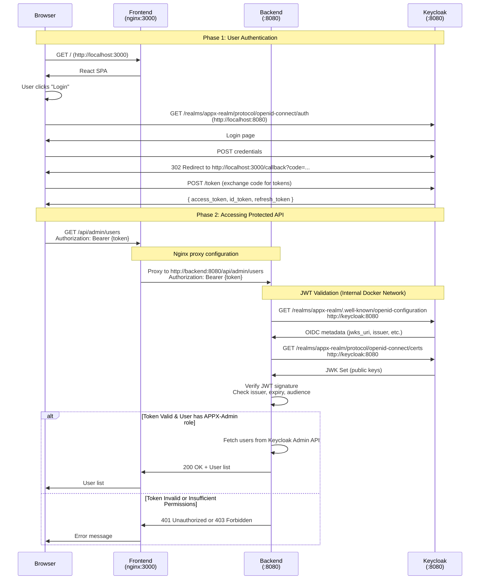

# Network and Port Configuration Analysis Report

## Executive Summary

This report analyzes the network architecture, port configurations, and service connectivity of the Keycloak-based authentication system. **Critical configuration errors have been identified that will prevent the application from functioning correctly.**

## Table of Contents
- [Current Architecture (IST-Zustand)](#current-architecture-ist-zustand)
- [Identified Problems](#identified-problems)
- [Target Architecture (SOLL-Zustand)](#target-architecture-soll-zustand)
- [Required Fixes](#required-fixes)
- [Port Mapping Tables](#port-mapping-tables)
- [Request Flow](#request-flow)
- [Security Considerations](#security-considerations)

---

## Current Architecture (IST-Zustand)



### Current Configuration Files

#### docker-compose.yml
```yaml
services:
  keycloak:
    image: quay.io/keycloak/keycloak:22.0.5
    ports: "8080:8080"

  backend:
    build: ./backend
    ports: "8081:8080"
    environment:
      - ISSUER_URI=http://localhost:8080/realms/appx-realm  # ❌ WRONG
      - JWK_SET_URI=http://keycloak:8080/realms/.../certs   # ✅ CORRECT

  frontend:
    build: ./frontend
    ports: "3000:80"
    args:
      REACT_APP_KEYCLOAK_AUTHORITY: http://localhost:8080/...  # ⚠️ Build-time only
```

#### frontend/nginx.conf
```nginx
location /api {
  proxy_pass http://backend:8080;  # ✅ CORRECT - Uses Docker hostname
}
```

---

## Identified Problems

### 🔴 Critical Issue 1: Backend Cannot Reach Keycloak

**Location:** `docker-compose.yml` Line 20

```yaml
SPRING_SECURITY_OAUTH2_RESOURCESERVER_JWT_ISSUER_URI=http://localhost:8080/realms/appx-realm
```

**Problem:**
- The Backend container tries to connect to `localhost:8080`
- Inside a Docker container, `localhost` refers to the container itself, NOT the host
- Keycloak is running on `keycloak:8080` (Docker hostname)

**Impact:**
- JWT validation fails completely
- Backend cannot verify access tokens
- All authenticated requests will fail with 401 Unauthorized

**Evidence:**
```
backend/src/main/resources/application.yml:6
  issuer-uri: ${...ISSUER_URI:http://localhost:8080/realms/appx-realm}
```

Spring Security calls `{issuer-uri}/.well-known/openid-configuration` to fetch OIDC metadata. This fails when issuer-uri points to localhost.

### 🟡 Issue 2: No Explicit Docker Network

**Problem:**
- All services run in the default Docker bridge network
- No network isolation or explicit configuration

**Impact:**
- Poor maintainability
- Difficult to add network policies
- Best practices violation

### 🟡 Issue 3: Missing Health Checks

**Problem:**
- Backend starts immediately after Keycloak
- No health check ensures Keycloak is ready
- Race condition: Backend may try to connect before Keycloak is accepting connections

**Impact:**
- Startup failures in CI/CD
- Unpredictable behavior on first startup

### 🟡 Issue 4: Port Mapping Inconsistency

**Current State:**
- Backend exposed on host port 8081 → container port 8080
- Frontend nginx proxies to `backend:8080` (container-internal)

**Issue:**
- Confusing: Two different ways to access backend (direct port 8081 vs nginx proxy)
- Port 8081 likely unnecessary if all API calls go through nginx

### 🟠 Issue 5: Frontend Build-Time Configuration

**Problem:**
```dockerfile
ARG REACT_APP_KEYCLOAK_AUTHORITY=http://localhost:8080/realms/appx-realm
```

**Impact:**
- URLs are baked into the React build at compile time
- Not portable across environments
- Works only when deployed at `localhost:3000`

**Note:** This is acceptable for development but problematic for production deployments.

### 🟠 Issue 6: Hardcoded Secrets

**Location:** `docker-compose.yml` Line 25

```yaml
KEYCLOAK_CLIENT_SECRET=your-backend-client-secret
```

**Problem:**
- Placeholder secret still in configuration
- Production: Should use Docker secrets or environment variable injection

---

## Target Architecture (SOLL-Zustand)



### Key Improvements

1. **Corrected Backend → Keycloak Communication**
   - Backend uses `http://keycloak:8080` for all connections

2. **Explicit Docker Network**
   - Named network `app-network` for service discovery

3. **Health Checks**
   - Keycloak health check ensures service is ready
   - Backend waits for Keycloak before starting

4. **Simplified Port Exposure**
   - Backend no longer exposed to host (optional: keep 8081 for debugging)

---

## Required Fixes

### Fix 1: Correct Backend Issuer-URI

**File:** `docker-compose.yml`

**Change:**
```yaml
backend:
  environment:
    # BEFORE (WRONG):
    - SPRING_SECURITY_OAUTH2_RESOURCESERVER_JWT_ISSUER_URI=http://localhost:8080/realms/appx-realm

    # AFTER (CORRECT):
    - SPRING_SECURITY_OAUTH2_RESOURCESERVER_JWT_ISSUER_URI=http://keycloak:8080/realms/appx-realm
```

**Rationale:** Backend must use Docker service name `keycloak` to reach Keycloak container.

### Fix 2: Add Docker Network

**File:** `docker-compose.yml`

**Add to bottom of file:**
```yaml
networks:
  app-network:
    driver: bridge
```

**Add to each service:**
```yaml
services:
  keycloak:
    networks:
      - app-network
  backend:
    networks:
      - app-network
  frontend:
    networks:
      - app-network
```

### Fix 3: Add Health Checks

**File:** `docker-compose.yml`

**Add to Keycloak service:**
```yaml
keycloak:
  healthcheck:
    test: ["CMD-SHELL", "curl -f http://localhost:8080/health/ready || exit 1"]
    interval: 10s
    timeout: 5s
    retries: 5
    start_period: 60s
```

**Update Backend dependency:**
```yaml
backend:
  depends_on:
    keycloak:
      condition: service_healthy
```

### Fix 4: Simplify Backend Port Exposure (Optional)

**Option A - Remove Direct Access (Recommended):**
```yaml
backend:
  # Remove ports section entirely
  # ports:
  #   - "8081:8080"
```

All API access goes through nginx proxy at `/api`.

**Option B - Keep for Debugging:**
```yaml
backend:
  ports:
    - "8081:8080"  # Direct API access for debugging
```

### Fix 5: Add CORS Configuration

**File:** `backend/src/main/java/com/example/keycloakbackend/SecurityConfig.java`

**Add CORS configuration:**
```java
@Bean
public SecurityFilterChain securityFilterChain(HttpSecurity http) throws Exception {
    http
        .cors(cors -> cors.configurationSource(corsConfigurationSource()))
        .authorizeHttpRequests(authorize -> authorize
            .requestMatchers("/api/public/**").permitAll()
            .anyRequest().authenticated()
        )
        .oauth2ResourceServer(oauth2 -> oauth2
            .jwt(jwt -> jwt.jwtAuthenticationConverter(jwtAuthConverter))
        );
    return http.build();
}

@Bean
public CorsConfigurationSource corsConfigurationSource() {
    CorsConfiguration configuration = new CorsConfiguration();
    configuration.setAllowedOrigins(List.of("http://localhost:3000"));
    configuration.setAllowedMethods(List.of("GET", "POST", "PUT", "DELETE", "OPTIONS"));
    configuration.setAllowedHeaders(List.of("*"));
    configuration.setAllowCredentials(true);
    return new UrlBasedCorsConfigurationSource() {{
        registerCorsConfiguration("/**", configuration);
    }};
}
```

### Fix 6: Update Client Secret

**File:** `docker-compose.yml`

Replace placeholder with actual secret from Keycloak admin console:
```yaml
backend:
  environment:
    - KEYCLOAK_CLIENT_SECRET=${KEYCLOAK_CLIENT_SECRET}  # Read from .env file
```

Create `.env` file:
```
KEYCLOAK_CLIENT_SECRET=actual-secret-from-keycloak
```

---

## Port Mapping Tables

### Current Configuration (IST)

| Service  | Container Port | Host Port | Accessible From        | Status |
|----------|----------------|-----------|------------------------|--------|
| Keycloak | 8080           | 8080      | Browser, Host          | ✅ OK  |
| Backend  | 8080           | 8081      | Host (direct)          | ⚠️ Confusing |
| Backend  | 8080           | -         | Frontend nginx proxy   | ✅ OK  |
| Frontend | 80 (nginx)     | 3000      | Browser                | ✅ OK  |

### Target Configuration (SOLL)

| Service  | Container Port | Host Port      | Accessible From        | Notes                          |
|----------|----------------|----------------|------------------------|--------------------------------|
| Keycloak | 8080           | 8080           | Browser                | OAuth/OIDC endpoints           |
| Backend  | 8080           | (none)         | Frontend nginx only    | Internal service               |
| Frontend | 80 (nginx)     | 3000           | Browser                | Proxies `/api` to backend      |

### Service-to-Service Communication (SOLL)

| From     | To       | URL                                           | Purpose                |
|----------|----------|-----------------------------------------------|------------------------|
| Browser  | Frontend | http://localhost:3000                         | React SPA              |
| Browser  | Keycloak | http://localhost:8080/realms/appx-realm       | OAuth login flows      |
| Frontend | Backend  | http://backend:8080/api/*                     | API calls (proxied)    |
| Backend  | Keycloak | http://keycloak:8080/realms/appx-realm        | JWT validation         |

---

## Request Flow

### Authentication and API Call Flow (Corrected)



### Key Flow Details

1. **Browser to Keycloak:**
   - Uses `http://localhost:8080` (host port)
   - Direct HTTP access for OAuth flows

2. **Browser to Frontend:**
   - Uses `http://localhost:3000` (host port)
   - React SPA served by nginx

3. **Frontend to Backend:**
   - nginx proxy: `/api` → `http://backend:8080`
   - Uses Docker service name `backend`
   - Internal Docker network communication

4. **Backend to Keycloak:**
   - Uses `http://keycloak:8080` (Docker service name)
   - JWT validation and metadata retrieval
   - **Critical:** Must NOT use `localhost`

---

## Security Considerations

### 1. Exposed Credentials

**Issue:** Admin credentials in docker-compose.yml
```yaml
keycloak:
  environment:
    - KEYCLOAK_ADMIN=admin
    - KEYCLOAK_ADMIN_PASSWORD=admin
```

**Risk:** Acceptable for development, **critical vulnerability in production**

**Recommendation:**
- Development: Current approach is acceptable
- Production: Use Docker secrets or external secret management (Vault, AWS Secrets Manager)

### 2. Client Secret Management

**Current:** Placeholder value `your-backend-client-secret`

**Required Actions:**
1. Generate strong secret in Keycloak admin console
2. Store in `.env` file (not committed to git)
3. Reference via environment variable

### 3. CORS Configuration

**Current:** Missing or default settings

**Required:**
- Explicitly allow `http://localhost:3000` in development
- Production: Restrict to actual domain(s)
- Enable credentials for cookie-based auth

### 4. HTTPS Considerations

**Current:** All HTTP (acceptable for development)

**Production Requirements:**
- Keycloak MUST run on HTTPS
- Add reverse proxy (nginx, Traefik) with SSL termination
- Update all URLs to `https://`
- Configure Keycloak with `KC_HOSTNAME_STRICT=true`

### 5. Token Exposure

**Current:** Tokens sent in Authorization headers

**Recommendations:**
- ✅ Good: Using Authorization header (not query params)
- ⚠️ Consider: HttpOnly cookies for additional XSS protection
- ✅ Good: JWT validation on backend (not just frontend)

### 6. Network Isolation

**After Fix 2:** Services in dedicated `app-network`

**Benefits:**
- Service discovery via DNS
- Potential to add network policies
- Better isolation from other Docker services

---

## Verification Steps

After applying fixes, verify the configuration:

### 1. Start Services
```bash
docker-compose up -d
```

### 2. Check Keycloak Health
```bash
curl http://localhost:8080/health/ready
# Should return: {"status":"UP"}
```

### 3. Verify Backend Can Reach Keycloak
```bash
docker-compose exec backend curl http://keycloak:8080/health/ready
# Should return: {"status":"UP"}
```

### 4. Check OIDC Configuration
```bash
curl http://localhost:8080/realms/appx-realm/.well-known/openid-configuration
# Should return JSON with jwks_uri, issuer, etc.
```

### 5. Test Frontend Access
```bash
curl http://localhost:3000
# Should return HTML of React app
```

### 6. Test API Proxy
```bash
curl http://localhost:3000/api/public/data
# Should return: "This is public data"
```

### 7. Test Authenticated Endpoint
```bash
# First, get token from Keycloak (use Keycloak admin console or Postman)
curl -H "Authorization: Bearer {token}" http://localhost:3000/api/secure/data
# Should return: "This is secured data" (if token valid)
```

---

## Summary

### Critical Fixes (Must Do)
- [ ] Change Backend Issuer-URI from `localhost:8080` to `keycloak:8080`
- [ ] Add explicit Docker network
- [ ] Add Keycloak health check
- [ ] Update Backend dependency to wait for Keycloak healthy
- [ ] Add CORS configuration to Backend
- [ ] Replace placeholder client secret

### Recommended Improvements
- [ ] Remove Backend port 8081 mapping (keep internal only)
- [ ] Add volume for Keycloak data persistence
- [ ] Create `.env` file for sensitive configuration
- [ ] Document Keycloak realm import process
- [ ] Add logging configuration for troubleshooting

### Current Status
❌ **Application will NOT work** with current configuration due to incorrect Issuer-URI

✅ **Application will work** after applying Fix 1 (minimum) or all Critical Fixes (recommended)

---

## Configuration Reference

### Complete Fixed docker-compose.yml (Preview)

```yaml
services:
  keycloak:
    image: quay.io/keycloak/keycloak:22.0.5
    command: start-dev --import-realm
    volumes:
      - ./keycloak:/opt/keycloak/data/import
    environment:
      - KEYCLOAK_ADMIN=admin
      - KEYCLOAK_ADMIN_PASSWORD=admin
      - KC_HOSTNAME_STRICT=false
      - KC_HOSTNAME_STRICT_HTTPS=false
    ports:
      - "8080:8080"
    networks:
      - app-network
    healthcheck:
      test: ["CMD-SHELL", "curl -f http://localhost:8080/health/ready || exit 1"]
      interval: 10s
      timeout: 5s
      retries: 5
      start_period: 60s

  backend:
    build: ./backend
    environment:
      - SPRING_SECURITY_OAUTH2_RESOURCESERVER_JWT_ISSUER_URI=http://keycloak:8080/realms/appx-realm
      - SPRING_SECURITY_OAUTH2_RESOURCESERVER_JWT_JWK_SET_URI=http://keycloak:8080/realms/appx-realm/protocol/openid-connect/certs
      - KEYCLOAK_AUTH_SERVER_URL=http://keycloak:8080
      - KEYCLOAK_REALM=appx-realm
      - KEYCLOAK_RESOURCE=appx-backend
      - KEYCLOAK_CLIENT_SECRET=${KEYCLOAK_CLIENT_SECRET}
    depends_on:
      keycloak:
        condition: service_healthy
    networks:
      - app-network

  frontend:
    build:
      context: ./frontend
      dockerfile: Dockerfile
      args:
        REACT_APP_KEYCLOAK_AUTHORITY: http://localhost:8080/realms/appx-realm
        REACT_APP_KEYCLOAK_CLIENT_ID: appx-frontend
        REACT_APP_KEYCLOAK_REDIRECT_URI: http://localhost:3000
    ports:
      - "3000:80"
    depends_on:
      - backend
    networks:
      - app-network

networks:
  app-network:
    driver: bridge
```

---

**Report Generated:** 2025-10-16
**Analyzed Components:** docker-compose.yml, nginx.conf, application.yml, SecurityConfig.java
**Critical Issues Found:** 1 (Backend Issuer-URI)
**Total Issues Found:** 6
**Recommendation:** Apply all Critical Fixes before deployment
